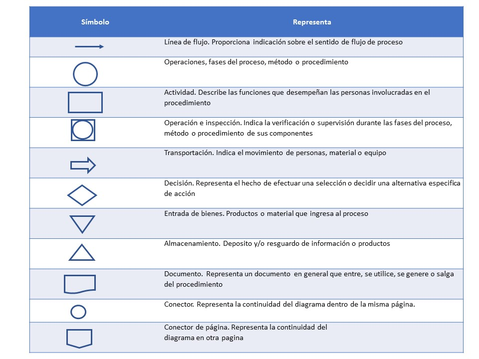

**MANUAL DE PROCEDIMIENTOS DEL AREA DE CONTABILIDAD** 

**SUPER PROMOCIONES DE ACAYUCAN S.A DE C.V**

**SPA-AF-01**

**octubre 2018**

||MANUAL DE PROCEDIMIENTOS DEL AREA DE CONTABILIDAD  | Página  2 de 49 |
|--|--|--|
||**Referencia a la Norma ISO 9001: 2015**|**Edición: 01** 
	**Fecha:Octubre 2018**  
 **Codigo:SPA-AC-01**|

# Hoja de autorización
SUPER PROMOCIONES DE ACAYUCAN S.A DE C.V 

| Elaboro | Reviso | Autorizo  |
|     :--:       |:--:        |      :--:|
|Mayte Sheila Martinez de la Cruz| LIC.Artemio Perez Moratilla   |LIC. Alejandro Soriano Morales 	|
|Residente|Contador general|Gerente general|

|Modificaciones |
|---|

|Edición |Fecha |Descripción del motivo de la modificación  |
|--|--|--|
|  |   |  |

||MANUAL DE PROCEDIMIENTOS DEL AREA DE CONTABILIDAD  | Página  3 de 49 |
|--|--|--|
||**Referencia a la Norma ISO 9001: 2015**|**Edición: 01** 
	**Fecha:Octubre 2018**  
 **Codigo:SPA-AC-01**|

Índice 

||MANUAL DE PROCEDIMIENTOS DEL AREA DE CONTABILIDAD  | Página  4 de 49 |
|--|--|--|
||**Referencia a la Norma ISO 9001: 2015**|**Edición: 01** 
	**Fecha:Octubre 2018**  
 **Codigo:SPA-AC-01**|

# Introducción 

El presente Manual de Procedimientos tiene como propósito contar como una guía clara y específica que garantice la óptima operación y desarrollo de las diferentes actividades dentro del área de contabilidad de SUPER PROMOCIONES DE ACAYUCAN S.A DE C.V, para la mejora y estandarización de sus procesos y procedimientos.
Comprende en forma ordenada, secuencial y detallada las operaciones de los procedimientos a seguir para cada actividad, promoviendo el buen desarrollo administrativo y operativo dentro de esta área. Este manual cuenta con todos los procesos y procedimientos que se realizan en el área de contabilidad el encargado de esta área, los responsables de cada proceso, el desarrollo de cada procedimiento y los formatos utilizados en ciertos procesos. 
 Es importante señalar, que este documento está sujeto a actualización en la medida que se presenten variaciones en la ejecución de los procedimientos, en la normatividad establecida, y en la estructura o especificaciones de la norma ISO 9001:2015, o bien en algún otro aspecto que influya en la operatividad del mismo, con el fin de cuidar su vigencia operativa.

||MANUAL DE PROCEDIMIENTOS DEL AREA DE CONTABILIDAD  | Página  5 de 49 |
|--|--|--|
||**Referencia a la Norma ISO 9001: 2015**|**Edición: 01** 
	**Fecha:Octubre 2018**  
 **Codigo:SPA-AC-01**| 

# Objetivo del manual

Guiar a los empleados en el trabajo para garantizar la optimización de los procesos y procedimientos dentro del área de contablidad

# Objetivos específicos:
Proporcionar a todos los empleados el manual de procedimientos para que tengan una guía de cómo deben realizar cada uno de sus funciones 
* Capacitar a cada empleado nuevo o empleado con antigüedad, en la manera que debe ocupar el manual de procedimientos; dando una introducción de la estructura, distribución del contenido y desarrollo de los procedimientos del manual.
* Implementar el manual de procedimientos dentro del área de contabilidad
* Realizar un análisis cada 2 meses para ver los resultados obtenidos dentro de cada área de la empresa

# Alcance del manual 

Este manual de procedimientos será aplicado dentro de los procesos administrativos y operativos del área de contabilidad de SUPER PROMOCIONES DE ACAYUCAN S.A DE C.V

||MANUAL DE PROCEDIMIENTOS DEL AREA DE CONTABILIDAD  | Página  6 de 49 |
|--|--|--|
||**Referencia a la Norma ISO 9001: 2015**|**Edición: 01** 
	**Fecha:Octubre 2018**  
 **Codigo:SPA-AC-01**| 

# Simbología de los diagramas de flujo 

 

||MANUAL DE PROCEDIMIENTOS DEL AREA DE CONTABILIDAD  | Página  7 de 49 |
|--|--|--|
||**Referencia a la Norma ISO 9001: 2015**|**Edición: 01** 
	**Fecha:Octubre 2018**  
 **Codigo:SPA-AC-01/1**| 

|Diagrama de flujo||
|--|--|
|Procedimiento |Generación de las aportaciones de seguridad social  |
|Puesto|Contador general |

||MANUAL DE PROCEDIMIENTOS DEL AREA DE CONTABILIDAD  | Página  8 de 49 |
|--|--|--|
||**Referencia a la Norma ISO 9001: 2015**|**Edición: 01** 
	**Fecha:Octubre 2018**  
 **Codigo:SPA-AC-01/1**| 

 

||MANUAL DE PROCEDIMIENTOS DEL AREA DE CONTABILIDAD  | Página  9 de 49 |
|--|--|--|
||**Referencia a la Norma ISO 9001: 2015**|**Edición: 01** 
	**Fecha:Octubre 2018**  
 **Codigo:SPA-AC-01/1**| 

|Descripción de procedimientos                           |
|-----------------------------------------------------|
| **PUESTO:** Contador general 
 **JEFE INMEDIATO:** Gerente general  
 **PROCEDIMIENTO:** 
 Generación de las aportaciones de seguridad social  
 **FRECUENCIA:**  
 La realización de dicha actividad es cada fin de mes   
 **OBJETIVO DEL PROCEDIMIENTO:**  
 Realizar las aportaciones necesarias a los trabajadores en el periodo correspondiente  
 **ALCANCE:** 
 Aplica al contador general realizar la generación de las aportaciones de seguridad social y de el jefe de finanzas realizar los pagos a tiempo 
 **POLITICAS:**
 La empresa otorga a todo trabajador las aportaciones de seguridad social    
 **RESPONSABILIDADES:**
 Es responsabilidad del Contador general realizar la generación de aportaciones de seguridad social cada fin de mes 
 Es responsabilidad del Jefe de finanzas realizar los pagos de las aportaciones  
 **DEFINICIONES:** 
 **IDSE:** Sistema electrónico para empresas desarrollado por el IMSS 
 **Aportación:** Es la contribución en algo; en este caso la contribución económica a las aportaciones de seguridad social  |

||MANUAL DE PROCEDIMIENTOS DEL AREA DE CONTABILIDAD  | Página  10 de 49 |
|--|--|--|
||**Referencia a la Norma ISO 9001: 2015**|**Edición: 01** 
	**Fecha:Octubre 2018**  
 **Codigo:SPA-AC-01/1**| 

|PROCEDIMIENTO: GENERACIÓN DE LAS APORTACIONES DE SEGURIDAD SOCIAL |
|---|

|No.|Actividad|Documento|
|--|--|--|
|1 |1.Ingresar a la página del IDSE https://idse.imss.gob.mx/imss/ ; en el cual deberá ingresar los datos: 
 *Certificado digital 
 *Usuario 
 *Contraseña 
 Ya ingresado los datos requeridos seleccionar iniciar sesión ||
|2|Seleccionar la opción de emisión ||
|3|Clic en aceptar |Liquidación de cuotas IMSS | 
|4|Descargar la emisión actual |Resumen de liquidación |
|5|Crear una carpeta con el nombre y mes de la emisión; posteriormente guardar el archivo en la carpeta  || 
|6|Extraer el archivo comprimido ||
|7|Abrir el archivo descargado e insertar una columna a un costado de los días laborados, en el cual deberá poner el área que pertenece cada trabajador abreviadamente como por ejemplo el trabajador de oficina se pondrá OF, si son de sucursales es S1, S2, S3 etc.||

||MANUAL DE PROCEDIMIENTOS DEL AREA DE CONTABILIDAD  | Página  11 de 49 |
|--|--|--|
||**Referencia a la Norma ISO 9001: 2015**|**Edición: 01** 
	**Fecha:Octubre 2018**  
 **Codigo:SPA-AC-01/1**| 

|PROCEDIMIENTO: GENERACIÓN DE LAS APORTACIONES DE SEGURIDAD SOCIAL |
|---|

|No.|Actividad|Documento|
|--|--|--|
|8|Hacer el concentrado del IMSS en plantilla anterior; en el cual debe cambiar los datos por los actuales; para esto debe hacer una consulta en el Excel que se agrego la columna de las áreas de los trabajadores: 
 *Clic en filtrar y seleccionar el área que se va mandar al concentrado 
 *Copiar la consulta obtenida y pegarla en el concentrado en el área correspondiente; realizar estos mismo con las demás áreas hasta agregar todas en el concentrado  |Movimientos no registrados en el IMSS|
|9|Realizar el archivo SUA: Ingresar a SUA y llenar los datos de la ventana llamada “Cálculos oportunos” |Calculo de diferencias|
|10|Generar el archivo de pago; para esto deberá ingresar a la página del IDSE https://idse.imss.gob.mx/imss/; en el cual deberá ingresar los datos: 
 *Certificado digital 
 *Usuario 
 *Contraseña 
 Ya ingresado los datos requeridos seleccionar iniciar sesión 
 *Seleccionar la opción de confronta |Cedula de determinación de cuotas |
|11|Imprimir los documentos |Cedula de determinación de cuotas obrero-patronales, aportaciones y amortizaciones |
|12|Mandar a finanzas la documentación para que realicen el pago correspondiente ||
|13|Recibir la documentación con el comprobante de pago; para su contabilización ||

||MANUAL DE PROCEDIMIENTOS DEL AREA DE CONTABILIDAD  | Página  12 de 49 |
|--|--|--|
||**Referencia a la Norma ISO 9001: 2015**|**Edición: 01** 
	**Fecha:Octubre 2018**  
 **Codigo:SPA-AC-01/2**| 

|Diagrama de flujo||
|--|--|
|Procedimiento |Elaboración de nóminas  |
|Puesto|Contador general |

||MANUAL DE PROCEDIMIENTOS DEL AREA DE CONTABILIDAD  | Página  13 de 49 |
|--|--|--|
||**Referencia a la Norma ISO 9001: 2015**|**Edición: 01** 
	**Fecha:Octubre 2018**  
 **Codigo:SPA-AC-01/2**| 

|Descripción de procedimientos                           |
|-----------------------------------------------------|
| **PUESTO:** Contador general 
 **JEFE INMEDIATO:** Gerente general  
 **PROCEDIMIENTO:** 
 Elaboración de nóminas   
 **FRECUENCIA:**  
 La realización de dicha actividad es cada fin de semana   
 **OBJETIVO DEL PROCEDIMIENTO:**  
 Generar comprobantes de información de los pagos de los trabajadores cada semana  
 **ALCANCE:** 
 Aplica al contador general el acceso de la información de los trabajadores para poder realizar las nóminas de cada semana y al jefe de finanzas para realizar el pago de las nóminas  
 **POLITICAS:**
 La empresa otorga a todo trabajador un comprobante de pago cada fin de semana   
 **RESPONSABILIDADES:**
 Es responsabilidad del Contador general solicitar los documentos necesarios para realizar las nóminas de cada sucursal y de la elaboración de las mismas  
 Es responsabilidad del Jefe de finanzas realizar los pagos de las nóminas semanales  
 **DEFINICIONES:** 
 **Nómina:**  
 **Aspel-Noi:**  
 **Excel:**  |
