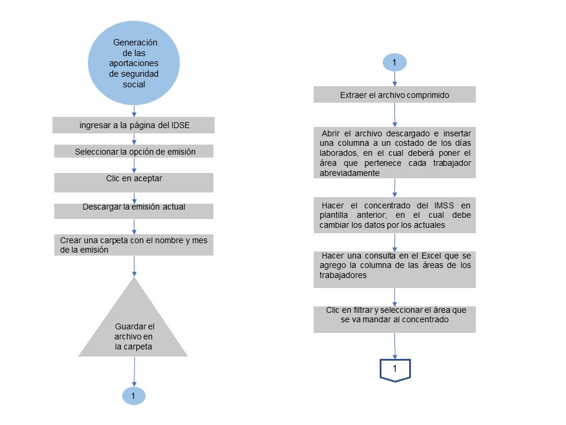

# MANUAL DE PROCEDIMIENTOS DEL ÁREA DE CONTABILIDAD

**SUPER PROMOCIONES DE ACAYUCAN S.A DE C.V**

**SPA-AF-01**
          
**octubre 2018**
 
# Hoja de autorización del área de contabilidad

SUPER PROMOCIONES DE ACAYUCAN S.A DE C.V 

| Elaboro | Reviso | Autorizo  |
|     :--:       |:--:        |      :--:|
|Mayte Sheila Martinez de la Cruz| LIC.Artemio Perez Moratilla   |LIC. Alejandro Soriano Morales 	|
|Residente|Contador general|Gerente general|

 

|Modificaciones |
|---|

|Edición |Fecha |Descripción del motivo de la modificación  |
|--|--|--|
|  |   |  |

 

# Introducción 

El presente Manual de Procedimientos tiene como propósito contar como una guía clara y específica que garantice la óptima operación y desarrollo de las diferentes actividades dentro del área de contabilidad de SUPER PROMOCIONES DE ACAYUCAN S.A DE C.V, para la mejora y estandarización de sus procesos y procedimientos.  Comprende en forma ordenada, secuencial y detallada las operaciones de los procedimientos a seguir para cada actividad, promoviendo el buen desarrollo administrativo y operativo dentro de esta área. Este manual cuenta con todos los procesos y procedimientos que se realizan en el área de contabilidad el encargado de esta área, los responsables de cada proceso, el desarrollo de cada procedimiento y los formatos utilizados en ciertos procesos.   Es importante señalar, que este documento está sujeto a actualización en la medida que se presenten variaciones en la ejecución de los procedimientos, en la normatividad establecida, y en la estructura o especificaciones de la norma ISO 9001:2015, o bien en algún otro aspecto que influya en la operatividad del mismo, con el fin de cuidar su vigencia operativa.
 

 

# Objetivos 

## Objetivo del manual

Guiar a los empleados en el trabajo para garantizar la optimización de los procesos y procedimientos dentro del área de contablidad

## Objetivos específicos
Proporcionar a todos los empleados el manual de procedimientos para que tengan una guía de cómo deben realizar cada uno de sus funciones 
* Capacitar a cada empleado nuevo o empleado con antigüedad, en la manera que debe ocupar el manual de procedimientos; dando una introducción de la estructura, distribución del contenido y desarrollo de los procedimientos del manual.
* Implementar el manual de procedimientos dentro del área de contabilidad
* Realizar un análisis cada 2 meses para ver los resultados obtenidos dentro de cada área de la empresa

## Alcance del manual 

Este manual de procedimientos será aplicado dentro de los procesos administrativos y operativos del área de contabilidad de SUPER PROMOCIONES DE ACAYUCAN S.A DE C.V

 

# Simbología de los diagramas de flujo 
 
 
 
  

# Descripción de los procedimientos 

## Generación de las aportaciones de seguridad social

|Diagrama de flujo||
|--|--|
|Procedimiento |Generación de las aportaciones de seguridad social  |
|Puesto|Contador general | 

 

  

 

|Descripción de procedimientos                           |
|-----------------------------------------------------|
| **PUESTO:** Contador general  **JEFE INMEDIATO:** Gerente general   **PROCEDIMIENTO:**  Generación de las aportaciones de seguridad social   **FRECUENCIA:**   La realización de dicha actividad es cada fin de mes    **OBJETIVO DEL PROCEDIMIENTO:**   Realizar las aportaciones necesarias a los trabajadores en el periodo correspondiente   **ALCANCE:**  Aplica al contador general realizar la generación de las aportaciones de seguridad social y de el jefe de finanzas realizar los pagos a tiempo  **POLITICAS:**  La empresa otorga a todo trabajador las aportaciones de seguridad social     **RESPONSABILIDADES:**  Es responsabilidad del Contador general realizar la generación de aportaciones de seguridad social cada fin de mes  Es responsabilidad del Jefe de finanzas realizar los pagos de las aportaciones   **DEFINICIONES:**  **IDSE:** Sistema electrónico para empresas desarrollado por el IMSS  **Aportación:** Es la contribución en algo; en este caso la contribución económica a las aportaciones de seguridad social  | 

  

|PROCEDIMIENTO: GENERACIÓN DE LAS APORTACIONES DE SEGURIDAD SOCIAL |
|---|

|No.|Actividad|Documento|
|--|--|--|
|1 |Ingresar a la página del IDSE https://idse.imss.gob.mx/imss/ ; en el cual deberá ingresar los datos:  -Certificado digital  -Usuario  -Contraseña  Ya ingresado los datos requeridos seleccionar iniciar sesión ||
|2|Seleccionar la opción de emisión ||
|3|Clic en aceptar |Liquidación de cuotas IMSS | 
|4|Descargar la emisión actual |Resumen de liquidación |
|5|Crear una carpeta con el nombre y mes de la emisión; posteriormente guardar el archivo en la carpeta  || 
|6|Extraer el archivo comprimido ||
|7|Abrir el archivo descargado e insertar una columna a un costado de los días laborados, en el cual deberá poner el área que pertenece cada trabajador abreviadamente como por ejemplo el trabajador de oficina se pondrá OF, si son de sucursales es S1, S2, S3 etc.|| 
|8|Hacer el concentrado del IMSS en plantilla anterior; en el cual debe cambiar los datos por los actuales; para esto debe hacer una consulta en el Excel que se agrego la columna de las áreas de los trabajadores:  -Clic en filtrar y seleccionar el área que se va mandar al concentrado  -Copiar la consulta obtenida y pegarla en el concentrado en el área correspondiente; realizar estos mismo con las demás áreas hasta agregar todas en el concentrado  |Movimientos no registrados en el IMSS|
|9|Realizar el archivo SUA: Ingresar a SUA y llenar los datos de la ventana llamada “Cálculos oportunos” |Calculo de diferencias|
|10|Generar el archivo de pago; para esto deberá ingresar a la página del IDSE https://idse.imss.gob.mx/imss/; en el cual deberá ingresar los datos:  -Certificado digital  -Usuario  -Contraseña  Ya ingresado los datos requeridos seleccionar iniciar sesión  -Seleccionar la opción de confronta |Cedula de determinación de cuotas |
|11|Imprimir los documentos |Cedula de determinación de cuotas obrero-patronales, aportaciones y amortizaciones |
|12|Mandar a finanzas la documentación para que realicen el pago correspondiente ||
|13|Recibir la documentación con el comprobante de pago; para su contabilización ||

  

## Elaboración de nóminas 

|Diagrama de flujo||
|--|--|
|Procedimiento |Elaboración de nóminas  |
|Puesto|Contador general |

|Descripción de procedimientos                           |
|-----------------------------------------------------|
| **PUESTO:** Contador general  **JEFE INMEDIATO:** Gerente general   **PROCEDIMIENTO:**  Elaboración de nóminas    **FRECUENCIA:**   La realización de dicha actividad es cada fin de semana    **OBJETIVO DEL PROCEDIMIENTO:**   Generar comprobantes de información de los pagos de los trabajadores cada semana   **ALCANCE:**  Aplica al contador general el acceso de la información de los trabajadores para poder realizar las nóminas de cada semana y al jefe de finanzas para realizar el pago de las nóminas   **POLITICAS:**  La empresa otorga a todo trabajador un comprobante de pago cada fin de semana    **RESPONSABILIDADES:**  Es responsabilidad del Contador general solicitar los documentos necesarios para realizar las nóminas de cada sucursal y de la elaboración de las mismas   Es responsabilidad del Jefe de finanzas realizar los pagos de las nóminas semanales   **DEFINICIONES:**  **Nómina:** Se refiere a la cantidad pagada a los empleados por los servicios que prestaron durante un cierto período de tiempo  **Aspel-Noi:** Sistema de Nómina Integral que Controla y automatiza todos los aspectos de la nómina y emite recibos de nómina electrónicos de acuerdo con la Reforma Fiscal vigente. Realiza un fácil, correcto y preciso cálculo de impuestos y aportaciones de seguridad social.  **Excel:** Es una aplicación de hojas de cálculo que forma parte de la suite de oficina Microsoft Office. Es una aplicación utilizada en tareas financieras y contables, con fórmulas, gráficos y un lenguaje de programación. |

  

|PROCEDIMIENTO: ELABORACIÓN DE NÓMINAS |
|---|

|No.|Actividad|Documento|
|--|--|--|
|1 |Checar que la asistencia en Aspel-NOI sea igual que en el programa de asistencia dentro de la empresa ;para esto se debe ingresar a la carpeta donde se encuentra la relación de la asistencia de los empleados de cada sucursal ,para poder ingresar se necesita el usuario y la contraseña ;posteriormente deberá poner la fecha de inicio en la parte que diga fecha I y la fecha del fin de la semana en donde dice fecha II ;la semana empieza a contar desde el sábado hasta el viernes||
|2|Anotar las incidencias durante la semana en una libreta; para esto se debe llamar a los encargados de cada sucursal y pedir que nos notifiquen el porqué de las incidencias y que otras hay que no sabemos; para que sea más fácil poder distinguir en donde se encuentran cada una de ellas al momento de registrarlas se debe separar por sucursal.||
|3|Ingresar a Aspel-NOI seleccionar a la empresa en este caso SUPER PROMOCIONES DE ACAYUCAN S.A DE C.V y poner la contraseña| |
|4|Revisar por sucursal y agregar las incidencias; para esto sigue los siguientes pasos:  -Ingresa al menú Nómina > Movimientos a la Nómina > Por trabajador.  -Registra los datos que se solicitan, de acuerdo al movimiento que deseas registrar.   Revisa la información capturada y oprime el botón “Aceptar”, inmediatamente se registrará el movimiento.  Revisa en la Consulta, el movimiento que afecta a cada trabajador desde el menú Nómina >Movimientos a la Nómina o directamente desde el recibo del trabajador que se encuentra en el menú Nómina:  -Nómina del trabajador >Movimientos.
|5|Buscar la plantilla del concentrado de movimientos de la nómina Excel; por ejemplo, puede ocupar el de la semana anterior al que vaya elaborar, solo copie y pegue, cambie de nombre al archivo y borre los datos anteriores, por último, modifique el periodo de la nómina ||
|6|Abrir Aspel-NOI para hacer una consulta de las nóminas y exportar a Excel la consulta ||
|7|Abrir el archivo de Excel exportado para poner los datos necesarios de cada área y sucursal en la plantilla del concentrado de movimientos de la nómina correspondiente:  -Filtrar por área el archivo exportado; el resultado que se obtiene se copia y pega en el archivo de Excel del periodo correspondiente “la plantilla de Excel “; hacer este paso hasta acabar con todas las áreas y sucursales ||
|8 |Recibir la documentación de los créditos de los trabajadores durante la semana por sucursal (concentrado de cuatro columnas de descuentos)||
|9|Ingresar los datos en la plantilla de Excel del concentrado de movimientos de la nómina de la semana correspondiente; para esto ir a la pestaña que dice “calendario” ahí aparecerá un concentrado en el cual se debe llenar con los datos nuevos de la semana de los préstamos o créditos por sucursal; esto para tener toda la información ocupada en el mismo archivo ||
|10|Regresar a la pestaña llamada “nomina” y seguir llenado las tablas del concentrado; deberá ir agregando por trabajador si tiene un préstamo, crédito o un faltante en caja en el caso de las cajeras.; para estos checar el concentrado de cuatro columnas llamado “descuentos de la semana y la fecha correspondiente”||
|11|Checar que todos los descuentos agregados cuadren; tanto en el concentrado de cuatro columnas como en el concentrado de movimientos de la nómina en Excel||
|12|Imprimir la nómina por sucursal, el concentrado de movimientos de Excel, la lista de raya, el recibo y la lista de asistencia de la semana ||
|13|Mandar los documentos al área de finanzas para que realicen el pago correspondiente||

## Alta de trabajadores en Aspel-NOI

|Diagrama de flujo||
|--|--|
|Procedimiento |Alta de trabajadores en Aspel-NOI |
|Puesto|Contador general |

 

|Descripción de procedimientos                           |
|-----------------------------------------------------|
| **PUESTO:** Contador general  **JEFE INMEDIATO:** Gerente general   **PROCEDIMIENTO:**  Alta de trabajadores en Aspel-NOI    **FRECUENCIA:**   La realización de dicha actividad es cada que hay nuevos trabajadores    **OBJETIVO DEL PROCEDIMIENTO:**   Poder controlar y automatizar la información del trabajador con respecto a la nómina, cálculo de impuestos y aportaciones de seguridad social.  **ALCANCE:**  Aplica al contador general tener el acceso al programa de Aspel-NOI y realizar las altas de trabajadores     **POLITICAS:**  Todo trabajador tiene que estar dado de alta al programa de Aspel-NOI   **RESPONSABILIDADES:** Es responsabilidad del gerente de tienda mandar los papeles de los trabajadores nuevos en la tienda  a su cargo al contador general   Es responsabilidad del contador general dar de alta a los nuevos trabajadores en la empresa en el programa de Aspel-NOI   **DEFINICIONES:**  **Impuesto:** Es un tributo que se paga al estado para soportar los gastos públicos. Estos pagos obligatorios son exigidos tantos a personas físicas, como a personas jurídicas.  **Aspel-NOI:** Sistema de Nómina Integral que Controla y automatiza todos los aspectos de la nómina y emite recibos de nómina electrónicos de acuerdo con la Reforma Fiscal vigente. Realiza un fácil, correcto y preciso cálculo de impuestos y aportaciones de seguridad social.  **Alta:** Ingreso o inscripción al trabajador en los programas o sistemas de la empresa |

 

|PROCEDIMIENTO: ELABORACIÓN DE NÓMINAS |
|---|

|No.|Actividad|Documento|
|--|--|--|
|1 |Recibir la documentación del trabajador nuevo (solicitud de empleo, INE, comprobante de domicilio, etc.) por parte de las encargadas de cada sucursal ||
|2|Ingresar al programa de Aspel-NOI, seleccionar a la empresa en la cual vamos a trabajar en este caso SUPER PROMOCIONES DEACAYUCAN S.A DE C.V y poner la contraseña para poder ingresar ||
|3|Ir al menú Nómina posteriormente dar clic en trabajadores||
|4|Seleccionar el icono “Agregar” de la barra de herramientas||
|5|Capturar la información correspondiente en cada sección:  -Datos Generales.  -Salario.  -Datos personales.  IMSS.  -Salud.  -Fiscales, entre otros. ||
|6|Presionar el botón “Aceptar”, o presiona el botón “Guardar (F3)”, si deseas agregar más información sin salir de la ventana. || 

## Alta de trabajadores en el IDSE

|Diagrama de flujo||
|--|--|
|Procedimiento |Alta de trabajadores en el IDSE |
|Puesto|Contador general |

 

|Descripción de procedimientos                           |
|-----------------------------------------------------|
| **PUESTO:** Contador general  **JEFE INMEDIATO:** Gerente general   **PROCEDIMIENTO:**  Alta de trabajadores en el IDSE   **FRECUENCIA:**   La realización de dicha actividad es cada que hay nuevos trabajadores    **OBJETIVO DEL PROCEDIMIENTO:**   Automatizar los movimientos afiliatorios de los trabajadores desde la empresa.  **ALCANCE:**  Aplica al contador general tener el acceso al sitio de el IDSE y realizar los cambios pertinentes     **POLITICAS:**  Todo trabajador tiene que estar dado de alta en el IDSE  **RESPONSABILIDADES:**  Es responsabilidad del gerente de tienda mandar los papeles de los trabajadores nuevos en la tienda  a su cargo al contador general   Es responsabilidad del contador general dar de alta a los nuevos trabajadores en la empresa en el IDSE   **DEFINICIONES:**  **IDSE:** Significa IMSS desde su empresa en este se puedes realizar diferentes tramites como, altas, bajas, modificaciones de salario de los empleados, descargar la emisión mensual anticipada (EMA) así como la emisión bimestral anticipada (EBA) y la determinación de la prima de riesgo, la confronta, entre otros.   **Alta:** Ingreso o inscripción al trabajador en los programas o sistemas de la empresa  | 

 

|PROCEDIMIENTO: ALTA DE TRABAJADORES EN EL IDSE |
|---|

|No.|Actividad|Documento|
|--|--|--|
|1 |Tener los documentos para dar de alta a un trabajador en el IDSE:  **Patrón**  -Número Patronal de Identificación Electrónica.  -Certificado Digital.  -Firma Electrónica Avanzada (FIEL, o E. Firma).  **Trabajador**  -Número de seguridad social del trabajador o los trabajadores  -Número de Seguridad Social (NSS), digito verificador del NSS  -Unidad de Medicina Familiar (UMF)  -Salario diario integrado  -Tipo de salario, tipo de jornada y fecha de movimiento  -Sus datos generales  ||
|2|Ingresar a la página del IDSE https://idse.imss.gob.mx/imss/ ||
|3|Llenar los datos y requerimientos necesarios para ingresar al IDSE||
|4|Ubicar el apartado Movimientos afiliatorios y posteriormente la liga que permitirá realizar el registro del trabajador||
|5|Agregar todos los datos o la información del trabajador que se registra:  -Registro patronal  -Tipo de movimiento: ALTA  -Número de seguridad social  -Digito verificador  -Apellido paterno y materno del asegurado  -Nombre del asegurado  -Clave del trabajador (opcional)  -CURP (opcional)  -UMF  -Salario diario integrado  -Tipo de trabajador  -Tipo de salario  -Jornada reducida  -Fecha de movimiento ||
|6|Dar agregar; hacer este mismo procedimiento en el caso de que sea más de un registro  ||
|7|Clic en enviar al terminar el registro; enseguida se nos requerirá que se firme el movimiento, por lo que el sistema nos solicitará que ingresemos el certificado digital con su respectiva contraseña||
|8|Descargar el recibo que corresponde.||

## Alta a trabajadores en el SUA

|Diagrama de flujo|   | 
|--|--|
|Procedimiento |Alta a trabajadores en el SUA|
|Puesto|Contador general |

|Descripción de procedimientos                           |
|-----------------------------------------------------|
| **PUESTO:** Contador general  **JEFE INMEDIATO:** Gerente general   **PROCEDIMIENTO:**  Alta a trabajadores en el SUA  **FRECUENCIA:**   La realización de dicha actividad es cada que hay nuevos trabajadores en el súper   **OBJETIVO DEL PROCEDIMIENTO:**   Determinar de manera automática las cuotas obrero-patronales del IMSS a pagar, así como las aportaciones y amortizaciones del Infonavit.   **ALCANCE:**  Aplica al contador general tener el acceso al programa informático llamado SUA para realizar las alta de los nuevos trabajadores, entre otros movimientos requeridos en dicho programa      **POLITICAS:**  Todo trabajador tiene que estar dado de alta en el SUA   **RESPONSABILIDADES:**  Es responsabilidad del gerente de tienda mandar los papeles de los trabajadores nuevos en la tienda  a su cargo al contador general  Es responsabilidad del contador general dar de alta a los nuevos trabajadores en la empresa en el SUA   **DEFINICIONES:**  **SUA:**  Sistema Único de Autodeterminación  **Alta:** Ingreso o inscripción al trabajador en los programas o sistemas de la empresa  |  

  

|PROCEDIMIENTO: ALTA A TRABAJADORES EN EL SUA|
|---|

|No.|Actividad|Documento|
|--|--|--|
|1|Checar si el trabajador tiene un crédito vigente del infonavit:   -Ingresar a la página del infonavit  | -Solicitud de empleo  -CURP  -Acta de nacimiento |
|2|Ingresar al SUA  correspondiente al súper||
|3|Dirigirse en el apartado “actualizar||
|4|Seleccionar trabajadores ||
|5|Ingresar los datos del trabajador  ||
|6|Seleccionar actualizar al terminar de ingresar los datos ||
|7|Elegir “si” en la notificación que aparece de que si se desea guardar al trabajador || 

## Agregar horas extras en Aspel-NOI

|Diagrama de flujo||
|--|--|
|Procedimiento |Agregar horas extras en Aspel-NOI |
|Puesto|Contador general | 

  

|Descripción de procedimientos                           |
|-----------------------------------------------------|
| **PUESTO:** Contador general  **JEFE INMEDIATO:** Gerente general   **PROCEDIMIENTO:**  Agregar horas extras en Aspel-NOI   **FRECUENCIA:**   La realización de dicha actividad es solo cuando se presenta la situación de que un trabajador haya trabajado más tiempo de lo establecido    **OBJETIVO DEL PROCEDIMIENTO:**   Llevar un control de los pagos de horas extras en el sistema de Aspel-NOI de cada trabajador.  **ALCANCE:**  Aplica al contador general tener el acceso al programa de Aspel-NOI Y agregar las horas extras de los trabajadores    **POLITICAS:**  Todo trabajador tiene derecho de recibir un pago extra por trabajar más tiempo de lo que sea su jornada laboral   **RESPONSABILIDADES:**  Es responsabilidad del gerente de tienda dar aviso de las horas extras de sus trabajadores a cargo  Es responsabilidad del contador general agregar las horas extras en la nómina correspondiente   **DEFINICIONES:**  **Hora extra :** Las horas extras, también llamadas horas extraordinarias, son el tiempo adicional que un empleado dedica a sus actividades laborales más allá de su horario habitual   **Aspel-NOI:** Sistema de Nómina Integral que Controla y automatiza todos los aspectos de la nómina y emite recibos de nómina electrónicos de acuerdo con la Reforma Fiscal vigente. Realiza un fácil, correcto y preciso cálculo de impuestos y aportaciones de seguridad social. | 

  

|PROCEDIMIENTO: AGREGAR HORAS EXTRAS EN ASPEL-NOI |
|---|

|No.|Actividad|Documento|
|--|--|--|
|1|Ingresar al programa de Aspel-NOI, seleccionar a la empresa en la cual vamos a trabajar en este caso SUPER PROMOCIONES DE ACAYUCAN S.A DE C.V y poner la contraseña para poder ingresar ||
|2|Ingresa al menú Nómina y selecciona Trabajadores. Dentro del catálogo selecciona el trabajador que se le agregara las horas extras; posteriormente selecciona el icono “Agregar”  de la barra de herramientas ||
|3|Seleccionar la opción de horas extras ||
|4|Agregar el monto ||
|5|Clic en aceptar || 

 

|Diagrama de flujo||
|--|--|
|Procedimiento |Descansar el archivo XML |
|Puesto|Auxiliar contable |

  

|Descripción de procedimientos                           |
|-----------------------------------------------------|
| **PUESTO:** Auxiliar de contabilidad  **JEFE INMEDIATO:** Contador general   **PROCEDIMIENTO:**  Descargar el archivo  XML  **FRECUENCIA:**   La realización de dicha actividad es diaria cuando se realiza un registro de egresos en Aspel-COI   **OBJETIVO DEL PROCEDIMIENTO:**   Poder contabilizar completamente cada póliza en ASPEL-COI y que este esté respaldado con el archivo XML, cumpliendo con las nuevas disposiciones de contabilidad electrónica.  **ALCANCE:**  Aplica al auxiliar contable tener el acceso y disposición de la cuenta de la empresa del SAT para descargar los archivos de XML de las facturas recibidas    **POLITICAS:**  Llevar la contabilidad electrónica diaria de la empresa cumpliendo con las nuevas disposiciones   **RESPONSABILIDADES:**  Es responsabilidad del auxiliar contable realizar las descargas de los archivos XML y ponerlos en la póliza correspondiente  **DEFINICIONES:**  **Aspel-COI:** Sistema de Contabilidad Integral.Integra la funcionalidad de la Contabilidad Electrónica. Procesa, integra y mantiene actualizada la información contable y fiscal de la empresa  **Archivo XML:** Es un archivo electrónico que almacena el detalle de un CFDI, en base a reglas y estándares que el SAT-SCHP determina necesarias para validar la autenticidad de la misma. |  

  

|PROCEDIMIENTO: DESCARGAR EL ARCHIVO XML |
|---|

|No.|Actividad|Documento|
|--|--|--|
|1|Ingresar a la página del SAT https://www.sat.gob.mx/empresas||
|2|Seleccionar donde dice factura electrónica; se desglosará varias opciones en el cual, selecciona la opción cancela y recupera tus facturas  ||
|3|Llenar los datos solicitados para ingresar: el RFC y la contraseña||
|4|Aparecera una ventana en el cual se selecciona la que dice consulta de facturas recibidas||
|5|Seleccionar el año. mes y día que queremos para descargar el XML y descargamos||
|6|Guardar el comprimido en una carpeta que sea del mismo mes para que se localice más rápido ||
|7|Buscar el comprimido y dar clic derecho aparece varias opciones en que cual selecciona el que dice extraer; esto hará que se copien el contenido del comprimido afuera en la carpeta que tenemos y esto facilitara a la hora de buscar el XML ||
|8|Borrar el comprimido porque ya extrajimos los archivos en la carpeta y ya no lo necesitamos || 

## Contabilización de egresos

|Diagrama de flujo||
|--|--|
|Procedimiento | Contabilización de egresos|
|Puesto|Auxiliar contable |

  

|Descripción de procedimientos                           |
|-----------------------------------------------------|
|**PUESTO:** Auxiliar de contabilidad  **JEFE INMEDIATO:** Contador general   **PROCEDIMIENTO:**  Contabilización de egresos  **FRECUENCIA:**   La realización de dicha actividad es diaria ya que todos los días se llevan a cabo egresos en la empresa  **OBJETIVO DEL PROCEDIMIENTO:**   Llevar una buena contabilidad de todos los pagos emitidos en cada sucursal  **ALCANCE:**   Aplica al auxiliar contable tener el acceso del programa de Aspel-COI para generar las pólizas de egresos correspondientes de cada sucursal   **POLITICAS:**  Llevar la contabilidad electrónica diaria de la empresa cumpliendo con las nuevas disposiciones   **RESPONSABILIDADES:**  Es responsabilidad del auxiliar contable llevar acabo la captura electrónica contable de los egresos de todo el súper   **DEFINICIONES:**  **Aspel-COI:** Sistema de Contabilidad Integral.Integra la funcionalidad de la Contabilidad Electrónica. Procesa, integra y mantiene actualizada la información contable y fiscal de la empresa  **Póliza de egreso:** Es un formato que tiene la función de servir como comprobante físico de una operación de salida de dinero de una compañía o negocio.| 

 

|PROCEDIMIENTO: CONTABILIZACIÓN DE EGRESOS|
|---|

|No.|Actividad|Documento|
|--|--|--|
|1|Recibir los Lefort de los egresos de cada sucursal||
|2| Abrir el programa llamado Aspel-COI 8.0 ||
|3|Seleccionar cuentas y pólizas ||
|4|Clic en pólizas y posteriormente en agregar esto para cada asiento contable que vayamos a registrar||
|5|Llenar los datos que pide el programa como:  -Escoger el tipo de póliza que se va realizar puede ser de egresos o de vez en cuando se ocupa la de diario  -Agregar el número de cheque  -Poner la fecha que se viene en el cheque  -Agregar un concepto dependiendo el caso y seguido la sucursal al que pertenezca la póliza ||
|6|Llenar los datos requeridos del asiento contable:  -No. De cuenta: va el número de cuenta del proveedor  -Concepto de movimiento: Buscar el proveedor y agregar el folio interno  -Debe o Haber: la cantidad que aparezca en la factura o cheque; va dependiendo del caso que se trate ||
|7|Agregar el XML de la factura después de poner la cantidad de cargo o abono cualquiera que sea el caso; ya que el programa nos lo pide automáticamente:  -Aparecerá una venta que dice “agregar datos de comprobantes”  -Clic en el icono que dice agregar comprobante  -Buscar el XML correspondiente a la factura y seleccionar  -Clic en SI; a la confirmación que aparece  -Clic en aceptar ||
|8|Al término de cada póliza aparecerá una venta que dice captura de operaciones con terceros; se tiene que checar que estén bien los impuestos (IVA, IEPS, ETC) generados en la factura  ||
|9|Dar guardar; así sucesivamente hasta terminar de capturar todos los egresos del Lefort ||
|10|Imprimir las pólizas, para estos sigue los siguientes pasos:  -Seleccionar en la barra de herramientas donde dice reportes  -Aparecerá una ventana llamada reporte de emisión de pólizas; debe seleccionar el tipo de póliza se va a imprimir en este caso será de egresos y agregar el rango, es decir, desde que número de póliza y hasta que numero de póliza es la que va a imprimir  -Guardar; y ya podremos ver cada registro que capturamos y podremos imprimir cada uno  ||
|11|Archivar al Lefort; el registro contable generado en Aspel-COI en cada póliza de cheque o de trasferencia.|| 

## Generar reportes de auxiliares 

|Diagrama de flujo||
|--|--|
|Procedimiento |Generar reportes de auxiliares 	|
|Puesto|Auxiliar contable |

  

|Descripción de procedimientos                           |
|-----------------------------------------------------|
|**PUESTO:** Auxiliar de contabilidad  **JEFE INMEDIATO:** Contador general   **PROCEDIMIENTO:**  Generar reportes de auxiliares   **FRECUENCIA:**   La realización de dicha actividad es frecuentemente al checar los movimientos de cada cuenta  **OBJETIVO DEL PROCEDIMIENTO:**   Tener información detallada de los movimientos de cada cuenta  **ALCANCE:**  Aplica al auxiliar contable tener el acceso del programa de Aspel-COI para generar los reportes auxiliares   **POLITICAS:**  Llevar la contabilidad electrónica diaria de la empresa cumpliendo con las nuevas disposiciones   **RESPONSABILIDADES:**  Es responsabilidad del auxiliar contable llevar acabo la captura electrónica contable de los movimientos de cada cuenta   **DEFINICIONES:**  **Aspel-COI:** Sistema de Contabilidad Integral.Integra la funcionalidad de la Contabilidad Electrónica. Procesa, integra y mantiene actualizada la información contable y fiscal de la empresa| 

 

|PROCEDIMIENTO: GENERAR REPORTES DE AUXILIARES |
|---|

|No.|Actividad|Documento|
|--|--|--|
|1|Ingresar a Aspel-COI y seleccionar SUPER PROMOCIONES DE ACAYUCAN S.A DE C.V; posteriormente poner la contraseña para poder ingresar al programa ||
|2|Seleccionar en la barra de herramientas en donde dice reportes||
|3|Clic en auxiliares  Aparecerá una ventana en el cual debe de llenar los datos para poder generar el reporte:  -No de cuenta; va el no. De cuenta del proveedor son 12 dígitos en el cada tres dígitos corresponden a algo especifico    xxx       xxx     xxx     xxx   -Los primeros tres son de la cuenta del proveedor   -Los siguientes tres son del orden en que se guardó al proveedor    -Los otros tres son de la clave del proveedor  -Los últimos tres dígitos pertenecen a la sucursal a la que pertenece  
 Esta clave se pone en desde y hasta; depende de que proveedor queremos ver el reporte  ||
|4|Agregar el periodo , es decir ,desde y hasta que día queremos el reporte ||
|5|Clic en aceptar; ya nos aparecerá el reporte que necesitamos ||   
          
## Capturar tabulares en Excel 
          
|Diagrama de flujo||
|--|--|
|Procedimiento |Capturar  tabulares en Excel 	|
|Puesto|Auxiliar contable |

 

|Descripción de procedimientos                           |
|-----------------------------------------------------|
|**PUESTO:** Auxiliar de contabilidad  **JEFE INMEDIATO:** Contador general   **PROCEDIMIENTO:**  Capturar  tabulares en Excel     **FRECUENCIA:**   La realización de dicha actividad es diaria  **OBJETIVO DEL PROCEDIMIENTO:**   Tener un registro de todos los ingresos diarios obtenidos en cada sucursal  **ALCANCE:**  Aplica al auxiliar contable  tener el acceso y control de los tabulares emitidos por las cajeras    **POLITICAS:**  Tener el control de todas las entradas de efectivo en la empresa    **RESPONSABILIDADES:**  Es responsabilidad del jefe de finanzas mandar los tabulares al auxiliar contable  Es responsabilidad del auxiliar contable llevar acabo la captura de todos los tabulares emitidos en cada sucursal   **DEFINICIONES:**  **Excel:** Es una aplicación de hojas de cálculo que forma parte de la suite de oficina Microsoft Office. Es una aplicación utilizada en tareas financieras y contables, con fórmulas, gráficos y un lenguaje de programación.   **Tabular:**  Formato de corte de caja en el cual se plasma toda la venta obtenida en la caja ;con el fin de describir todo el ingreso con sus respectivas denominaciones y formas de pago |  
 

|PROCEDIMIENTO: CAPTURAR TABULARES EN EXCEL  |
|---|

|No.|Actividad|Documento|
|--|--|--|
|1|Recibir los tabulares del área de finanzas; de cada sucursal un día después de que los tabulares fueron emitidos en caja|Tabulares de corte de caja|
|2|Abrir la carpeta que dice tabulares que se encuentra en documentos||
|3|Clic en la plantilla que sea del año en el que se va capturar los tabulares ||
|4|Abrir la pestaña que sea de la sucursal que se vaya a capturar; cada sucursal esta por separado ||
|5|Llenar los siguientes datos dentro del Excel: fecha, faltantes, tabulares, importe y concepto de acuerdo a cada tabular||
|6|Pintar de amarillo la captura del tabular que este completo y al día que corresponde la captura.||
|7|Pintar de naranja cuando se haya hecho la captura de los tabulares con más de un día al de su captura y sean varias al mismo tiempo ||
|8|Pintar de verde cuando no se tenga la ficha de deposito ||
|9|guardar los registros. Realizar esto todos los días hasta que sea fin de mes para poder tener el concentrado||

## Realizar el concentrado de los tabulares en Excel

|Diagrama de flujo||
|--|--|
|Procedimiento |Realizar el concentrado de los tabulares en Excel|
|Puesto|Auxiliar contable | 

 

|Descripción de procedimientos                           |
|-----------------------------------------------------|
|**PUESTO:** Auxiliar de contabilidad  **JEFE INMEDIATO:** Contador general   **PROCEDIMIENTO:**  Realizar el concentrado de los tabulares en Excel      **FRECUENCIA:**   La realización de dicha actividad es cada fin de mes  **OBJETIVO DEL PROCEDIMIENTO:**   Tener en un solo documento los ingresos del mes de cada sucursal  **ALCANCE:**  Aplica al auxiliar contable  tener el acceso y control del registro de los tabulares para realizar el concentrado de estos.    **POLITICAS:**  Tener el control de todas las entradas de efectivo en la empresa    **RESPONSABILIDADES:**  Es responsabilidad del auxiliar contable tener el registro de los tabulares de las sucursales y de realizar el concentrado de cada sucursal al finalizar el mes    **DEFINICIONES:**  **Excel:** Es una aplicación de hojas de cálculo que forma parte de la suite de oficina Microsoft Office. Es una aplicación utilizada en tareas financieras y contables, con fórmulas, gráficos y un lenguaje de programación.   **Tabular:**  Formato de corte de caja en el cual se plasma toda la venta obtenida en la caja ;con el fin de describir todo el ingreso con sus respectivas denominaciones y formas de pago  | 

   

|PROCEDIMIENTO: REALIZAR EL CONCENTRADO DE LOS TABULARES EN EXCEL |
|---|

|No.|Actividad|Documento|
|--|--|--|
|1|Ingresar a la plantilla de Excel donde se lleva a cabo la captura de los tabulares|
|2|Copiar y pegar el ultimo concentrado de los tabulares de Excel para poder tener las formulas y datos ya predeterminados||
|3|Borrar la información anterior para dejar solo los encabezados, es decir la estructura del concentrado.||
|4|Poner el mes en el que estas realizando el concentrado y la sucursal  |Concentrado de tabulares |
|5|Llenar los datos que el concentrado requiere:  -Día: Anotar el día del tabular va en orden desde el primer día del mes hasta el ultimo  -Total de ventas: Anotar el total de la venta del día que viene en el tabular  -Suma: es el resultado de la suma de las ventas totales del día  || 
|6 |Imprimir el concentrado el fin de mes||

## Captura de tabulares en Aspel-COI

|Diagrama de flujo||
|--|--|
|Procedimiento |Captura de tabulares en Aspel-COI|
|Puesto|Auxiliar contable | 

  

|Descripción de procedimientos                           |
|-----------------------------------------------------|
|**PUESTO:** Auxiliar de contabilidad  **JEFE INMEDIATO:** Contador general   **PROCEDIMIENTO:**  Captura de tabulares en Aspel-COI      **FRECUENCIA:**   La realización de dicha actividad es  diaria  **OBJETIVO DEL PROCEDIMIENTO:**   Tener la contabilidad electrónica de los ingresos de cada sucursal  **ALCANCE:**  Aplica al auxiliar contable tener el acceso al programa de Aspel-COI para la capturación de los tabulares    **POLITICAS:**  Tener el control de todas las entradas de efectivo en la empresa    **RESPONSABILIDADES:**  Es responsabilidad del auxiliar contable tener el registro de los tabulares de las sucursales en el programa de Aspel-COI   **DEFINICIONES:**  **Tabular:**  Formato de corte de caja en el cual se plasma toda la venta obtenida en la caja ;con el fin de describir todo el ingreso con sus respectivas denominaciones y formas de pago  **Aspel-COI:** Sistema de Contabilidad Integral.Integra la funcionalidad de la Contabilidad Electrónica. Procesa, integra y mantiene actualizada la información contable y fiscal de la empresa |

  

|PROCEDIMIENTO: CAPTURA DE TABULARES EN ASPEL-COI |
|---|

|No.|Actividad|Documento|
|--|--|--|
|1|Tener el concentrado de los tabulares del mes.||
|2|Entrar a Aspel-COI y seleccionar la sucursal en el que se va registrar el concentrado de los ingresos; poner la contraseña para poder ingresar al programa||
|3|Poner el periodo en el que se va a trabajar y el mes ||
|4|Clic en agregar póliza: llenar los datos necesarios para la realización de la póliza:  -Agregar el tipo de póliza en este caso será la de ingresos (Ig)  -Fecha del tabular  -Concepto de la póliza  -Cuenta en el que los folios de los tabulares   -Concepto de movimiento; poner la sucursal y los folios de los tabulares   -Agregar los cargos y abonos de los tabulares |Póliza de ingreso|
|5|Sacar un auxiliar en este caso la balanza de comprobación: solo damos clic en balanza y ya está nuestro auxiliar ||  
|6|Ir a la cuenta de ventas y verificar que este en 0; si hay diferencias se tiene que buscar el problema y corregirlo||
|7|Imprimir las pólizas de ingresos ||
|8|Anexar las pólizas de ingresos en el Lefort de los tabulares || 

